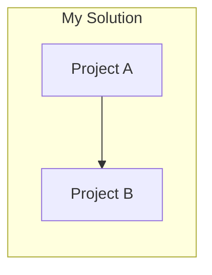
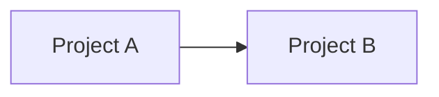

# Configuration Reference

This document covers every configuration option available in `SlnDependencyDiagramGenerator`. Configuration is defined via `DependencyGeneratorConfig` (in code) or serialised as JSON in `.sds` files (used by SlnDependencyStudio CLI and WPF).

---

## Quick Links

- [Diagram Generator Configuration](#diagram-generator-configuration)
  - [Solution Options](#solution-options)
  - [Diagram Options](#diagram-options)
  - [Export Options](#export-options)
- [Studio Project Document (.sds) Format](#studio-project-document-sds-format)
  - [Metadata](#metadata)
  - [Restore Solution](#restore-solution)
  - [Pre-Generation Command](#pre-generation-command)
  - [Post-Generation Command](#post-generation-command)
- [Path Resolution](#path-resolution)
- [Target Framework Discovery](#target-framework-discovery)
- [Tool Requirements](#tool-requirements)
- [Architecture Overview](#architecture-overview)

---

## Diagram Generator Configuration

The `DependencyGeneratorConfig` class is the root configuration object. It has three sub-sections:

| Property   | Type                       | Description                                                     |
| ---------- | -------------------------- | --------------------------------------------------------------- |
| `Solution` | `GeneratorSolutionOptions` | Solution path, filters, exclusions, and per-scope configuration |
| `Diagram`  | `GeneratorDiagramOptions`  | Diagram styling, direction, grouping, and output formats        |
| `Export`   | `GeneratorExportOptions`   | Export path and image format options                            |

### Solution Options

Defined by `GeneratorSolutionOptions`.

| Property              | Type           | Default | Description                                                                                                                                                                                                  |
| --------------------- | -------------- | ------- | ------------------------------------------------------------------------------------------------------------------------------------------------------------------------------------------------------------ |
| `SolutionPath`        | `string`       | `""`    | Relative or fully-qualified path to the `.sln` or `.slnx` solution file.                                                                                                                                     |
| `RegexToInclude`      | `string[]`     | `[]`    | One or more regex patterns to match solution projects to be processed. To match all `.csproj` files under a path, use a pattern like `\\.*\\.csproj`. Note that backslashes must be escaped in JSON strings. |
| `RegexToExclude`      | `string[]`     | `[]`    | Optional regex patterns to exclude matched projects.                                                                                                                                                         |
| `PackagesToExclude`   | `string[]`     | `[]`    | Optional NuGet package IDs to exclude from diagram and summary output. Case-insensitive. Transitive dependencies reachable only through excluded packages are also omitted.                                  |
| `FrameworksToExclude` | `string[]`     | `[]`    | Optional framework reference IDs to exclude from diagram and summary output. Case-insensitive.                                                                                                               |
| `Individual`          | `ProjectScope` | —       | Settings for generating per-project diagrams (see [Project Scope](#project-scope)).                                                                                                                          |
| `All`                 | `ProjectScope` | —       | Settings for generating a single combined solution diagram (see [Project Scope](#project-scope)).                                                                                                            |

#### Project Scope

Defined by `GeneratorSolutionOptions.ProjectScope`. Shared by both `Individual` and `All`.

| Property              | Type   | Default | Description                                                                                                                      |
| --------------------- | ------ | ------- | -------------------------------------------------------------------------------------------------------------------------------- |
| `Enabled`             | `bool` | `false` | Whether this scope is processed. At least one scope must be enabled.                                                             |
| `IncludeDependencies` | `bool` | `false` | Whether framework and package dependencies are included in the diagram.                                                          |
| `TransitiveDepth`     | `int`  | `0`     | How many levels of transitive (indirect) package references to traverse. `0` means no transitive packages. Must be 0 or greater. |

**Scope behaviour:**

- **Individual scope** (`Individual`): When enabled, the generator produces one diagram per matching project. Each diagram shows that project and its direct dependencies (framework references, explicit packages, and transitive packages up to the configured depth).
- **All scope** (`All`): When enabled, the generator produces a single combined diagram showing all matching projects and their collective dependency graph. This is useful for understanding the full solution-level dependency picture.

### Diagram Options

Defined by `GeneratorDiagramOptions`.

| Property          | Type               | Default | Description                                                                                                                                                                                                            |
| ----------------- | ------------------ | ------- | ---------------------------------------------------------------------------------------------------------------------------------------------------------------------------------------------------------------------- |
| `Direction`       | `DiagramDirection` | `LR`    | Flow direction of the diagram. Options: `LR` (left-to-right), `RL` (right-to-left), `TB` (top-to-bottom), `BT` (bottom-to-top).                                                                                        |
| `FrameworkStyle`  | `FillStyle`        | —       | Fill style for framework dependency nodes (see [Fill Style](#fill-style)).                                                                                                                                             |
| `PackageStyle`    | `FillStyle`        | —       | Fill style for explicit package dependency nodes (see [Fill Style](#fill-style)).                                                                                                                                      |
| `TransitiveStyle` | `FillStyle`        | —       | Fill style for transitive (implicit) package dependency nodes (see [Fill Style](#fill-style)).                                                                                                                         |
| `GroupName`       | `string`           | `""`    | The display name (title) for the group of projects on the diagram.                                                                                                                                                     |
| `GroupNameAlias`  | `string`           | `""`    | A short alias used in generated diagram files to represent the project group. This is a technical identifier (not visible in rendered image output) that enables visual grouping of projects in D2 and Mermaid syntax. |
| `Grouping`        | `GroupingOptions`  | —       | Grouping behaviour and style for diagram containers (see [Grouping Options](#grouping-options)).                                                                                                                       |
| `Formats`         | `DiagramFormat[]`  | `[]`    | Diagram formats to generate. Must contain at least one format. Options: `D2`, `Mermaid`.                                                                                                                               |

#### Fill Style

Defined by `GeneratorDiagramOptions.FillStyle`. Used by `FrameworkStyle`, `PackageStyle`, `TransitiveStyle`, and `GroupingOptions.BackgroundStyle`.

| Property  | Type     | Description                                                           |
| --------- | -------- | --------------------------------------------------------------------- |
| `Fill`    | `string` | RGB fill colour (e.g. `"#ECCBC0"`, `"#ADD8E6"`).                      |
| `Opacity` | `double` | Opacity value between 0.0 (fully transparent) and 1.0 (fully opaque). |

#### Grouping Options

Defined by `GeneratorDiagramOptions.GroupingOptions`.

| Property          | Type        | Default                       | Description                                                                                                                                     |
| ----------------- | ----------- | ----------------------------- | ----------------------------------------------------------------------------------------------------------------------------------------------- |
| `Enabled`         | `bool`      | `true`                        | When `true`, project and multi-version package grouping containers are rendered. When `false`, all nodes are rendered without group containers. |
| `BackgroundStyle` | `FillStyle` | Fill `#E7EBFC`, Opacity `1.0` | The fill style used for grouping container backgrounds.                                                                                         |

**Grouping behaviour:**

When grouping is enabled, the generator creates visual containers that group:

1. **Projects** — All projects in the current scope are rendered inside a group container labelled with `GroupName`.
2. **Multi-version packages** — When the same package appears with different resolved versions across projects, a grouping container is created for that package to highlight the version conflict.

> **Note:** Grouping renders as containers in both formats, but the visual result differs. D2 handles group containers well, whereas Mermaid wraps projects in nested `subgraph`s that its layout engine can render cluttered on larger solutions — for Mermaid output, consider setting `grouping.enabled: false`. See [Mermaid Diagrams](#mermaid-diagrams).

### Export Options

Defined by `GeneratorExportOptions`.

| Property        | Type                   | Default | Description                                                                                                                                                                                                                                  |
| --------------- | ---------------------- | ------- | -------------------------------------------------------------------------------------------------------------------------------------------------------------------------------------------------------------------------------------------- |
| `ClearContents` | `bool`                 | `false` | When `true`, clears the target framework output folder and diagram-format sub-folders (e.g. `d2/`, `mmd/`) before writing new files. Only sub-folders for configured formats are cleared.                                                    |
| `RootPath`      | `string`               | `""`    | Relative or fully-qualified export root path for generated diagram files and images. The generator creates sub-folders per target framework, and within each, per diagram renderer (e.g. `<RootPath>/net9.0/d2/`, `<RootPath>/net9.0/mmd/`). |
| `ImageFormats`  | `DiagramImageFormat[]` | `[]`    | Image formats to create from diagram files. Can be empty (text-only output) or any combination of: `Png`, `Svg`, `Pdf`.                                                                                                                      |

**Output folder structure:**

```
<RootPath>/
├── <target-framework-1>/
│   ├── d2/
│   │   ├── <project-name>-Individual.d2
│   │   ├── <project-name>-Individual.png
│   │   ├── <solution-scope>-All.d2
│   │   └── <solution-scope>-All.png
│   └── mmd/
│       ├── <project-name>-Individual.mmd
│       ├── <project-name>-Individual.png
│       ├── <solution-scope>-All.mmd
│       └── <solution-scope>-All.png
└── <target-framework-2>/
    └── ...
```

The `Dependency Summary.md` file is also written to each target-framework folder.

**File naming:**

Generated diagram and image files use normalised file-safe base names. For example, a project named `My.Project` with the Individual scope becomes `my-project-Individual.d2`. The solution-scope All diagram becomes `my-solution-all.d2`.

---

## Studio Project Document (.sds) Format

The `.sds` file is the saved dependency project document format used by SlnDependencyStudio CLI and WPF. It wraps the `DependencyGeneratorConfig` in an extensible envelope.

```json
{
  "schemaVersion": 1,
  "metadata": {
    "projectName": "My Solution",
    "description": "Dependency diagrams for My Solution"
  },
  "diagramGenerator": {
    "solution": {
      "solutionPath": "MySolution.sln",
      "regexToInclude": ["\\.*\\.csproj"],
      "regexToExclude": ["\\.*Tests\\.csproj"],
      "packagesToExclude": ["Some.Package"],
      "frameworksToExclude": ["Microsoft.NETCore.App"],
      "individual": {
        "enabled": true,
        "includeDependencies": true,
        "transitiveDepth": 1
      },
      "all": {
        "enabled": true,
        "includeDependencies": true,
        "transitiveDepth": 1
      }
    },
    "diagram": {
      "direction": "LR",
      "frameworkStyle": {
        "fill": "#ECCBC0",
        "opacity": 0.8
      },
      "packageStyle": {
        "fill": "#ADD8E6",
        "opacity": 0.8
      },
      "transitiveStyle": {
        "fill": "#FFEC96",
        "opacity": 0.8
      },
      "groupName": "My Solution",
      "groupNameAlias": "my",
      "grouping": {
        "enabled": true,
        "backgroundStyle": {
          "fill": "#E7EBFC",
          "opacity": 1
        }
      },
      "formats": ["D2", "Mermaid"]
    },
    "export": {
      "clearContents": true,
      "rootPath": "output",
      "imageFormats": ["Png", "Svg", "Pdf"]
    }
  },
  "restoreSolution": true,
  "preGeneration": {
    "enabled": false,
    "command": "",
    "arguments": "",
    "workingDirectory": "",
    "continueOnFailure": false
  },
  "postGeneration": {
    "enabled": false,
    "command": "",
    "arguments": "",
    "workingDirectory": ""
  }
}
```

| Property           | Type                        | Default | Description                                                                                                        |
| ------------------ | --------------------------- | ------- | ------------------------------------------------------------------------------------------------------------------ |
| `schemaVersion`    | `int`                       | `1`     | Schema version for forward compatibility. Currently `1`.                                                           |
| `metadata`         | `DependencyProjectMetadata` | —       | User-facing project metadata (see [Metadata](#metadata)).                                                          |
| `diagramGenerator` | `DependencyGeneratorConfig` | —       | The `DependencyGeneratorConfig` payload (see [Diagram Generator Configuration](#diagram-generator-configuration)). |
| `restoreSolution`  | `bool`                      | `true`  | When `true`, the solution is restored (via `dotnet restore`) before generation starts.                             |
| `preGeneration`    | `PreGenerationConfig`       | —       | Optional command that runs before generation (see [Pre-Generation Command](#pre-generation-command)).              |
| `postGeneration`   | `PostGenerationConfig`      | —       | Optional command that runs after generation (see [Post-Generation Command](#post-generation-command)).             |

**Forward compatibility:** Unknown JSON fields are preserved via `[JsonExtensionData]`. Editing a document with a newer schema version does not strip data from unknown fields.

### Metadata

Defined by `DependencyProjectMetadata`.

| Field         | Type     | Description                                                                            |
| ------------- | -------- | -------------------------------------------------------------------------------------- |
| `projectName` | `string` | A friendly display name for the dependency project. Not used during generation.        |
| `description` | `string` | An optional description of the project's purpose or scope. Not used during generation. |

### Restore Solution

`restoreSolution` is a top-level boolean on the document (default `true`). When enabled, the CLI and WPF run `dotnet restore` against the configured solution before generation so each project has an up-to-date `obj/project.assets.json`.

- In the CLI, a failed restore aborts the run with exit code `1009`.
- In the WPF application, this is exposed as the **Restore Solution** toggle on the Pipeline page.

### Pre-Generation Command

Defined by `PreGenerationConfig`, which extends the shared `ProcessCommandConfig` base (see below) and adds one field.

| Field               | Type     | Default | Description                                                                                                                                                        |
| ------------------- | -------- | ------- | ------------------------------------------------------------------------------------------------------------------------------------------------------------------ |
| `enabled`           | `bool`   | `false` | When `true`, the command runs before diagram generation.                                                                                                           |
| `command`           | `string` | `""`    | The executable or script to run (e.g. `"dotnet"`, `"cmd.exe"`, `"powershell.exe"`).                                                                                |
| `arguments`         | `string` | `""`    | Command-line arguments passed to the command. Tokens are split by spaces.                                                                                          |
| `workingDirectory`  | `string` | `""`    | Working directory for the command. When empty, defaults to the folder containing the `.sds` file. Relative paths are resolved against the `.sds` file's directory. |
| `continueOnFailure` | `bool`   | `false` | When `true`, diagram generation proceeds even if the command exits with a non-zero exit code. When `false`, generation is aborted.                                 |

### Post-Generation Command

Defined by `PostGenerationConfig`, which extends the shared `ProcessCommandConfig` base. It has the same `enabled`, `command`, `arguments`, and `workingDirectory` fields as the pre-generation command, but **no** `continueOnFailure` option.

| Field              | Type     | Default | Description                                                                                       |
| ------------------ | -------- | ------- | ------------------------------------------------------------------------------------------------- |
| `enabled`          | `bool`   | `false` | When `true`, the command runs after diagram generation completes.                                 |
| `command`          | `string` | `""`    | The executable or script to run.                                                                  |
| `arguments`        | `string` | `""`    | Command-line arguments passed to the command. Tokens are split by spaces.                         |
| `workingDirectory` | `string` | `""`    | Working directory for the command. When empty, defaults to the folder containing the `.sds` file. |

A failed post-generation command aborts the run with exit code `1006` (there is no `continueOnFailure` option to proceed anyway).

### Shared Process Command Configuration

Both `preGeneration` and `postGeneration` share a common base shape (`ProcessCommandConfig`) for the `enabled`, `command`, `arguments`, and `workingDirectory` fields, so the two sections are configured identically.

**Common use case — restore before generation:**

```json
{
  "restoreSolution": false,
  "preGeneration": {
    "enabled": true,
    "command": "dotnet",
    "arguments": "restore MySolution.sln",
    "workingDirectory": "",
    "continueOnFailure": false
  }
}
```

---

## Path Resolution

- **CLI:** Relative paths inside the `.sds` file (`solutionPath`, `rootPath`, `workingDirectory`) are resolved relative to the folder containing the `.sds` file. The `--projectFile` / `--pf` argument itself is resolved relative to the current working directory.
- **WPF:** The user can choose whether to store paths as absolute or relative to the `.sds` file directory (the **Use relative path** checkbox on the Solution and Export pages).

---

## Target Framework Discovery

Target frameworks are **auto-discovered** from each matching project's `obj/project.assets.json` file. You do not need to specify `targetFrameworks` in configuration.

**Requirements:**

- The solution must be restored or built **before** generation so each project has its `obj/project.assets.json` file. If these files are missing or stale, run `dotnet restore` or build the solution first — or enable `restoreSolution` to automate this.

**How it works:**

1. The generator reads each matching project's `obj/project.assets.json` to discover its target frameworks.
2. All unique target frameworks across all matching projects are collected.
3. The solution is parsed once per target framework, resolving project and framework references from evaluated MSBuild items, and package graphs from assets data.

**Note:** Malformed or unreadable solution files (`.sln` or `.slnx`) fail fast with a clear error message; no fallback parsing is attempted.

---

## Tool Requirements

### D2 Diagrams

- **Diagram generation** (`.d2` files): No external tools required.
- **Image export** (PNG, SVG, PDF): Requires the [D2 CLI](https://d2lang.com/tour/install/) to be available on PATH (or configured via an explicit path override).

**PNG export notes:** D2's PNG export may have specific requirements depending on your platform. See the [D2 export documentation](https://d2lang.com/ko/tour/exports/) for details on potential issues and workarounds.

### Mermaid Diagrams

- **Diagram generation** (`.mmd` files): No external tools required.
- **Image export** (PNG, SVG, PDF): Requires [Mermaid CLI (mmdc)](https://github.com/mermaid-js/mermaid-cli#installation) to be available on PATH (or configured via an explicit path override).

**Grouping hint:** Mermaid's layout engine generally produces cleaner diagrams when grouping is disabled (`grouping.enabled: false`). With grouping enabled, projects and conflicting packages are wrapped in nested `subgraph` containers, which Mermaid can struggle to lay out — the output becomes cluttered and harder to read on larger solutions. D2 handles the same containers more gracefully, so it is common to keep grouping enabled for D2 output but disable it for Mermaid. The bundled sample does exactly this: `Samples/DiagramGeneratorSample/appsettings.d2.json` enables grouping while `appsettings.mmd.json` disables it. The difference is visible in the generated [D2 example](../Studio%20Diagrams/net10.0/d2/slndependencydiagramgenerator.d2) (projects inside a group container) versus the [Mermaid example](../Studio%20Diagrams/net10.0/mmd/slndependencydiagramgenerator.mmd) (flat).

With grouping **enabled**, projects are rendered inside a subgraph:



With grouping **disabled**, the same projects render flat:



### Tool Detection

Tool detection uses a layered resolution strategy:

1. **Explicit path override** — If configured (in WPF application settings or via code), the override path is used directly.
2. **PATH discovery** — Uses platform-appropriate commands (`where` on Windows, `which` on non-Windows) via `AllOverIt.Process` to locate the tool on the system PATH.
