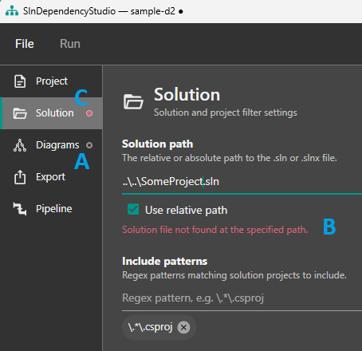

# SlnDependencyStudio WPF User Guide

SlnDependencyStudio WPF is a Windows desktop application for authoring, editing, and running dependency diagram projects. It provides a graphical interface over the `SlnDependencyDiagramGenerator` library, letting you configure solutions, diagram options, export settings, and generation workflows without editing JSON files manually.

**Target platform:** Windows 10+ (`net10.0-windows10.0.19041`)

---

## Table of Contents

- [Quick Start](#quick-start)
- [Application Shell](#application-shell)
- [Empty State](#empty-state)
- [Navigation Sidebar](#navigation-sidebar)
- [Dirty Tracking and Validation](#dirty-tracking-and-validation)
- [Project Page](#project-page)
- [Solution Page](#solution-page)
- [Export Page](#export-page)
- [Diagrams Page](#diagrams-page)
- [Pipeline Page](#pipeline-page)
- [Analyse vs Generate](#analyse-vs-generate)
- [Output Panel](#output-panel)
- [Application Settings](#application-settings)
- [Keyboard Shortcuts](#keyboard-shortcuts)
- [File Format](#file-format)
- [Sample Files](#sample-files)
- [Troubleshooting](#troubleshooting)
- [Screenshot Checklist](#screenshot-checklist)

---

## Quick Start

> **Pre-built:** SlnDependencyStudio is distributed as a pre-built Windows application — download the latest release from the [Releases page](https://github.com/mjfreelancing/SlnDependencyDiagramGenerator/releases). Alternatively, build and run it yourself with `dotnet run --project Studio\SlnDependencyStudio.Wpf`.

1. Launch SlnDependencyStudio.
2. On the empty state screen, click **New Project** to create a dependency project from defaults, or **Open Project** to load an existing `.sds` file.
3. Navigate through the sidebar sections to configure your project:
   - **Project** — Set the project name and description.
   - **Solution** — Select your `.sln` or `.slnx` file and configure filters.
   - **Export** — Set the output path and image formats.
   - **Diagrams** — Configure diagram styling, direction, and formats.
   - **Pipeline** — Configure restore, pre/post-generation commands, and check tool availability.
4. Press **F5** or click **Run > Generate** to start generation.
5. Monitor progress in the output panel at the bottom of the window.

---

## Application Shell


The main window follows an IDE-style layout:

- **Top:** Menu bar with **File** and **Run** menus.
- **Left sidebar:** Navigation panel with an item for each configuration page.
- **Centre:** Configuration editor for the currently selected navigation item.
- **Bottom:** Output panel displaying real-time generation and analysis logs.

### Menu Bar

| Menu     | Item                   | Shortcut       | Description                                                                   |
| -------- | ---------------------- | -------------- | ----------------------------------------------------------------------------- |
| **File** | **New Project**        | `Ctrl+N`       | Creates a new dependency project from application defaults.                   |
|          | **New from Existing…** | —              | Creates a new project by loading an existing `.sds` file as a starting point. |
|          | **Open Project…**      | `Ctrl+O`       | Opens an existing `.sds` project file.                                        |
|          | **Save**               | `Ctrl+S`       | Saves the current project.                                                    |
|          | **Save As…**           | `Ctrl+Shift+S` | Saves the current project to a new file.                                      |
|          | **Close**              | `Ctrl+F4`      | Closes the current project.                                                   |
|          | **Recent Projects**    | —              | Re-opens a recently opened project from the list.                             |
|          | **Settings…**          | —              | Opens the application settings dialog.                                        |
|          | **Exit**               | `Alt+F4`       | Exits the application.                                                        |
| **Run**  | **Analyse**            | `Shift+F5`     | Runs a pre-flight analysis (dry run) without generating anything.             |
|          | **Generate**           | `F5`           | Runs the full generation pipeline.                                            |

Analyse and Generate are enabled only when a project is open, no operation is running, and there are no validation errors.

While an operation (Analyse or Generate) is running:

- The **Run** menu and all File-menu actions are disabled.
- An overlay appears at the top right showing **Operation in progress** (or **Cancelling…** while cancellation is in progress).
- The main window cannot be closed.

### Closing with Unsaved Changes


Closing the project (`Ctrl+F4`) or the main window (`Alt+F4`) while there are unsaved changes shows a save changes prompt:

| Button      | Action                                                  |
| ----------- | ------------------------------------------------------- |
| **Save**    | Saves the project, then closes.                         |
| **Discard** | Discards the unsaved changes and closes without saving. |
| **Cancel**  | Returns to the application without closing.             |

---

## Empty State


When no project is loaded, the centre workspace shows an empty state with the following options:

- **New Project** — Creates a new dependency project from application defaults.
- **Open Project** — Opens a file browser to select an existing `.sds` file.
- **Recent Projects** — Lists recently opened projects for quick access. Each item can be removed by clicking its **X**, and entries whose files no longer exist are shown in red.

---

## Navigation Sidebar

The sidebar contains five navigation sections, in this order:

| #   | Section      | Purpose                                            |
| --- | ------------ | -------------------------------------------------- |
| 1   | **Project**  | Project name and description                       |
| 2   | **Solution** | Solution path, filters, exclusions, scopes         |
| 3   | **Export**   | Output path, clear behaviour, image formats        |
| 4   | **Diagrams** | Formats, direction, styling, grouping              |
| 5   | **Pipeline** | Restore, pre/post-generation commands, tool status |

Each navigation item shows two status indicators:

- A **red dot** when the section has validation errors.
- A **hollow ring** when the section has unsaved changes.

The sidebar is hidden automatically when no project is open. Opening a project selects the **Project** page by default.

---

## Dirty Tracking and Validation



Each configuration page tracks two independent states — unsaved changes and validation errors — surfaced through the navigation sidebar and the window title.

- **A - Unsaved changes (dirty)** — A **hollow ring** appears on the navigation item, and the window title appends a filled circle (e.g. `SlnDependencyStudio — sample-d2 ●`). A page becomes dirty as soon as any of its fields differ from the last saved version, and returns to clean when the project is saved.
- **B - Validation errors** — A **solid red dot** appears on the navigation item, and the page shows a red message under the offending field. For example, pointing the Solution page at a solution file that does not exist shows:

  ```text
  Solution file not found at the specified path.
  ```

  Validation errors must be resolved before you can run **Analyse** or **Generate** (see [Application Shell](#application-shell)).

- **C - Both together** — When a section has unsaved changes **and** validation errors, the navigation item shows a **red dot with a thin ring** hinting at the unsaved changes.

Hovering a navigation item shows a tooltip with its combined status: _"This section has unsaved changes"_, _"This section has validation errors"_, or _"This section has validation errors and unsaved changes"_.

---

## Project Page


The top-level metadata for your dependency project.

| Field             | Description                                       | Effect on Output                                       |
| ----------------- | ------------------------------------------------- | ------------------------------------------------------ |
| **File location** | The path to the open `.sds` file (read-only).     | —                                                      |
| **Project Name**  | A friendly name for the dependency project.       | Not used during generation; purely for identification. |
| **Description**   | An optional description of the project's purpose. | Not used during generation; purely for documentation.  |

_Validation:_ Project name must not be empty.

---

## Solution Page


Configures which solution to analyse, which projects to include or exclude, and per-scope dependency depth.

| Section                   | Field                | Description                                                                                  | Effect on Output                                                                                           |
| ------------------------- | -------------------- | -------------------------------------------------------------------------------------------- | ---------------------------------------------------------------------------------------------------------- |
| **Solution Path**         | Solution Path        | Path to your `.sln` or `.slnx` file. You can browse using the folder button.                 | Determines which solution is parsed. Paths can be stored relative to the `.sds` file or as absolute paths. |
|                           | Use Relative Path    | When enabled, the Browse button stores the path relative to the project file directory.      | Makes the `.sds` file portable across machines.                                                            |
| **Include Patterns**      | Regex To Include     | One or more regex patterns matching projects to process.                                     | Only projects whose paths match any of these patterns are included.                                        |
| **Exclude Patterns**      | Regex To Exclude     | Optional regex patterns to exclude certain projects.                                         | Matched projects are skipped even if they match an include pattern.                                        |
| **Packages to Exclude**   | Package IDs          | Optional NuGet package IDs to omit from diagrams. Case-insensitive.                          | Removes specified packages and their transitive chains from diagrams and the dependency summary.           |
| **Frameworks to Exclude** | Framework IDs        | Optional framework reference IDs to omit. Case-insensitive.                                  | Removes specified framework references from diagrams.                                                      |
| **Individual Scope**      | Enabled              | Whether to generate per-project diagrams.                                                    | When enabled, one diagram file is produced per matching project showing its dependency graph.              |
|                           | Include Dependencies | Whether to include framework and package dependencies.                                       | When disabled, the diagram shows only the project node without its dependencies.                           |
|                           | Transitive Depth     | How many levels of transitive (indirect) packages to show. `0` means no transitive packages. | Controls how deep the transitive package tree is rendered.                                                 |
| **All Scope**             | Enabled              | Whether to generate a single combined solution diagram.                                      | When enabled, one diagram file is produced showing all matching projects collectively.                     |
|                           | Include Dependencies | Whether to include framework and package dependencies.                                       | Same as Individual scope, but for the combined graph.                                                      |
|                           | Transitive Depth     | Transitive depth for the combined graph.                                                     | Same as Individual scope, but for the combined graph.                                                      |

_Validation:_ Solution path must not be empty and must point to an existing file. At least one scope (Individual or All) must be enabled.

---

## Diagrams Page


Controls how the diagram is styled and which diagram formats are generated.

| Section                 | Field              | Description                                                                                                            | Effect on Output                                                                                                                                     |
| ----------------------- | ------------------ | ---------------------------------------------------------------------------------------------------------------------- | ---------------------------------------------------------------------------------------------------------------------------------------------------- |
| **Diagram Formats**     | D2 / Mermaid       | Toggle to enable D2 (`.d2`) and/or Mermaid (`.mmd`) output.                                                            | At least one format must be selected.                                                                                                                |
| **Direction**           | Direction          | Flow direction of the diagram: Left-to-Right (`LR`), Right-to-Left (`RL`), Top-to-Bottom (`TB`), Bottom-to-Top (`BT`). | Controls the layout orientation of nodes and edges in generated diagrams.                                                                            |
| **Styles — Framework**  | Fill               | RGB hex colour for framework dependency nodes (e.g. `#ECCBC0`).                                                        | Sets the background colour of framework nodes in the diagram.                                                                                        |
|                         | Opacity            | Opacity value between 0.0 and 1.0.                                                                                     | Controls the transparency of framework node fills.                                                                                                   |
| **Styles — Package**    | Fill               | RGB hex colour for explicit package dependency nodes.                                                                  | Sets the background colour of package nodes in the diagram.                                                                                          |
|                         | Opacity            | Opacity for package nodes.                                                                                             | Controls transparency of package node fills.                                                                                                         |
| **Styles — Transitive** | Fill               | RGB hex colour for transitive (indirect) package dependency nodes.                                                     | Sets the background colour of transitive package nodes, helping them stand out from explicit packages.                                               |
|                         | Opacity            | Opacity for transitive nodes.                                                                                          | Controls transparency of transitive node fills.                                                                                                      |
| **Grouping**            | Enabled            | Whether project and multi-version package grouping containers are rendered.                                            | When enabled, projects are grouped in a visual container and multi-version packages get their own sub-containers. When disabled, all nodes are flat. |
|                         | Background Fill    | RGB hex colour for group container backgrounds.                                                                        | Sets the background colour of grouping containers.                                                                                                   |
|                         | Background Opacity | Opacity for group container backgrounds.                                                                               | Controls transparency of grouping container backgrounds.                                                                                             |
|                         | Name               | The display title for the group of projects on the diagram.                                                            | Appears as a heading/label in the diagram.                                                                                                           |
|                         | Alias              | A short alias used in generated diagram files.                                                                         | A technical identifier for the group container in D2/Mermaid syntax. Not visible in rendered image output.                                           |

_Validation:_ Fill colours are validated against the `#RRGGBB` hex format (or `#RGB` shorthand).

---

## Export Page


Controls where and how diagram files and images are saved.

| Field                   | Description                                                                                                                         | Effect on Output                                                                                                                                                                              |
| ----------------------- | ----------------------------------------------------------------------------------------------------------------------------------- | --------------------------------------------------------------------------------------------------------------------------------------------------------------------------------------------- |
| **Export Root**         | The export root directory. You can browse using the folder button. Relative paths are resolved against the `.sds` file's directory. | Generated diagram files and images are written to sub-folders under this path, organised by target framework and then by renderer (e.g. `<RootPath>/net10.0/d2/`, `<RootPath>/net10.0/mmd/`). |
| **Use Relative Path**   | When enabled, the Browse button stores the path relative to the project file directory.                                             | Makes the `.sds` file portable across machines.                                                                                                                                               |
| **Clear Output Folder** | When enabled, clears the output sub-folders for configured formats before writing new files.                                        | Prevents stale files from previous runs; only sub-folders for currently configured diagram formats are cleared.                                                                               |
| **Image Formats**       | One or more of: PNG, SVG, PDF. Can be empty for text-only output (`.d2` / `.mmd` files plus the summary).                           | When selected, the corresponding image files are generated from the diagram text files using the D2 CLI and/or Mermaid CLI (mmdc).                                                            |

_Validation:_ Export root must not be empty.

---

## Pipeline Page


The **Diagram Generation Processing Pipeline** page controls the steps that run around diagram generation and shows the status of external tools.

### Restore Solution

| Field                | Description                                                                                                      |
| -------------------- | ---------------------------------------------------------------------------------------------------------------- |
| **Restore Solution** | When enabled (default), runs `dotnet restore` on the solution before generation so project assets are available. |

### Pre-Generation Command

An optional command to run before diagram generation starts.

| Field                   | Description                                                                              |
| ----------------------- | ---------------------------------------------------------------------------------------- |
| **Enabled**             | When enabled, the command runs before generation.                                        |
| **Command**             | The executable or script to run (e.g. `dotnet`, `cmd.exe`). A browse button is provided. |
| **Arguments**           | Command-line arguments passed to the command.                                            |
| **Working Directory**   | The working directory for the command. Empty defaults to the `.sds` file's folder.       |
| **Use Relative Path**   | When enabled, stores the working directory relative to the project file directory.       |
| **Continue on Failure** | When enabled, generation proceeds even if the command exits with an error.               |

_Validation:_ When enabled, the command must not be empty, and the working directory must exist.

### Post-Generation Command

An optional command to run after diagram generation completes. It has the same fields as the pre-generation command (Enabled, Command, Arguments, Working Directory, Use Relative Path) but no **Continue on Failure** option.

### Tool Status

Shows the availability of external CLI tools required for image export:

| Tool     | Required For                         | Install Link                                                          |
| -------- | ------------------------------------ | --------------------------------------------------------------------- |
| **d2**   | D2 image export (PNG, SVG, PDF)      | [D2 CLI Install](https://d2lang.com/tour/install/)                    |
| **mmdc** | Mermaid image export (PNG, SVG, PDF) | [Mermaid CLI](https://github.com/mermaid-js/mermaid-cli#installation) |

Each tool entry shows:

- **Tool name** (d2 or mmdc)
- **Status** (Available / Not Found), e.g. `Found at <path>` or `Not found — install the tool or set a path override`
- **Resolved path** (executable location when found) or **Error message** (when not found)

Click **Re-scan** to re-check tool availability without restarting the application. A scan also runs automatically when you open the Pipeline page.

> **Note:** You can configure dependency projects regardless of tool availability. Missing tools only affect image export capabilities — diagram text files (`.d2`, `.mmd`) and the dependency summary are still generated.

---

## Analyse vs Generate

Both actions stream their output to the output panel, and support cancellation via the **Cancel** button or the overlay. If the project has unsaved changes, both save first.

### Analyse (dry run)


> 📷 **Screenshot needed:** `analyse-output.png` — the output panel after an Analyse run, showing discovered/included/excluded projects and tool readiness.

Press `Shift+F5` or select **Run > Analyse**. This runs a **pre-flight analysis** that:

1. Validates the configuration (fail-fast on errors).
2. Requires a solution path and discovers projects using the include/exclude regexes (defaulting to `.*\.csproj` when no include pattern is configured).
3. Reports all discovered projects, then classifies them as **included**, **excluded**, or **not matched** (with reasons).
4. Checks **tool readiness** for the configured export types (d2/mmdc), showing ✓/✗ per tool.

Analysis does **not** generate anything and does **not** run any pipeline commands. Use it before Generate to confirm the configuration will behave as expected.

### Generate

Press `F5` or select **Run > Generate** to run the full pipeline:

1. **Validate** the configuration.
2. **Restore** the solution (if enabled on the Pipeline page).
3. **Pre-generation command** (if enabled) — stops on failure unless Continue on Failure is set.
4. **Diagram generation** — project discovery, dependency resolution, framework processing, diagram emission, and optional image export.
5. **Post-generation command** (if enabled).

After generation completes, the output panel shows the completion status upon success, or error message if there was a problem.

---

## Output Panel

The output panel is docked at the bottom of the main window. It displays all non-artifact output from analysis and generation runs.

### Features

| Feature                 | Description                                                                                                                                                                                                                                               |
| ----------------------- | --------------------------------------------------------------------------------------------------------------------------------------------------------------------------------------------------------------------------------------------------------- |
| **Real-time streaming** | Messages appear as they are produced during analysis and generation.                                                                                                                                                                                      |
| **Log level colouring** | Error (red), Warning (orange), Debug (grey); Information uses the default theme foreground.                                                                                                                                                               |
| **Verbose**             | When enabled, Debug-level application log events are also shown in the output panel; when disabled, only Information level and above are shown. This is a display filter only — it does not change what is written to the rolling log file. Default: off. |
| **Wrap**                | Toggle to wrap long lines to the next line. Default: off.                                                                                                                                                                                                 |
| **Auto-scroll**         | Automatically scrolls to the bottom when new messages arrive. Default: on.                                                                                                                                                                                |
| **Cancel**              | Cancels the currently running operation (analysis or generation). Visible only while an operation is running.                                                                                                                                             |
| **Clear**               | Clears all messages from the panel.                                                                                                                                                                                                                       |
| **Copy All**            | Copies all output panel text to the clipboard (`Ctrl+Shift+C`).                                                                                                                                                                                           |
| **Save As…**            | Saves all output panel text to a file via a save dialog.                                                                                                                                                                                                  |

### Persisted Preferences

Output panel preferences (Verbose, Wrap, Auto-scroll) are persisted across sessions in application settings.

---

## Application Settings


Open **File > Settings…** to open the Settings dialog. Settings are stored in file-based AppData storage (not the Windows registry).

| Setting                    | Description                                                                                                                                              |
| -------------------------- | -------------------------------------------------------------------------------------------------------------------------------------------------------- |
| **Default project folder** | The default folder for Open/Save file dialogs when no project is loaded. Leave empty for no default.                                                     |
| **d2 executable**          | Explicit path to the d2 executable. Auto-detected if empty.                                                                                              |
| **mmdc executable**        | Explicit path to the mmdc executable. Auto-detected if empty.                                                                                            |
| **Log retention (days)**   | Number of days to retain rolling log files (default: 31 days; range 1–90). A restart is required for changes to take effect.                             |
| **Theme**                  | Choose between **Light** and **Dark** themes. The active theme preference is persisted across restarts; changes preview live and are reverted on Cancel. |

### Rolling File Logs

- Rolling log files are written to `%APPDATA%\SlnDependencyStudio\Logs\`, one file per day, with the naming pattern `studio-yyyyMMdd.txt` (e.g. `studio-20260814.txt`).
- Rolling logs are retained for the number of days configured in **Settings > Log retention (days)** (default: 31 days; range 1–90) and always capture **all log levels (Debug and above)**, independent of the output panel's Verbose toggle.

### State Persistence

The following application state is also persisted (separately from user settings):

- **Recent projects** — Recently opened `.sds` file paths, most recent first, capped at 10. Each item can be removed by clicking its **X**, and items whose files no longer exist on disk are shown in red.
- **Window placement** — Last-known main window position, size, and state (normal, maximised, minimised).

---

## Keyboard Shortcuts

| Shortcut       | Action                  |
| -------------- | ----------------------- |
| `Ctrl+N`       | New Project             |
| `Ctrl+O`       | Open Project            |
| `Ctrl+S`       | Save                    |
| `Ctrl+Shift+S` | Save As                 |
| `Ctrl+F4`      | Close Project           |
| `Shift+F5`     | Analyse (dry run)       |
| `F5`           | Generate                |
| `Ctrl+Shift+C` | Copy All (output panel) |
| `Alt+F4`       | Exit                    |

---

## File Format

SlnDependencyStudio uses `.sds` files (JSON format) for dependency projects. The file format is:

```json
{
  "schemaVersion": 1,
  "metadata": {
    "projectName": "My Project",
    "description": "Description of the project"
  },
  "diagramGenerator": {
    "solution": {
      "solutionPath": "MySolution.sln",
      "regexToInclude": ["\\.*\\.csproj"],
      "regexToExclude": ["\\.*Tests\\.csproj"],
      "packagesToExclude": ["Some.Package"],
      "frameworksToExclude": ["Microsoft.NETCore.App"],
      "individual": {
        "enabled": true,
        "includeDependencies": true,
        "transitiveDepth": 1
      },
      "all": {
        "enabled": true,
        "includeDependencies": true,
        "transitiveDepth": 1
      }
    },
    "diagram": {
      "direction": "LR",
      "frameworkStyle": {
        "fill": "#ECCBC0",
        "opacity": 0.8
      },
      "packageStyle": {
        "fill": "#ADD8E6",
        "opacity": 0.8
      },
      "transitiveStyle": {
        "fill": "#FFEC96",
        "opacity": 0.8
      },
      "groupName": "My Project",
      "groupNameAlias": "my",
      "grouping": {
        "enabled": true,
        "backgroundStyle": {
          "fill": "#E7EBFC",
          "opacity": 1
        }
      },
      "formats": ["D2", "Mermaid"]
    },
    "export": {
      "clearContents": true,
      "rootPath": "output",
      "imageFormats": ["Png", "Svg", "Pdf"]
    }
  },
  "restoreSolution": true,
  "preGeneration": {
    "enabled": false,
    "command": "",
    "arguments": "",
    "workingDirectory": "",
    "continueOnFailure": false
  },
  "postGeneration": {
    "enabled": false,
    "command": "",
    "arguments": "",
    "workingDirectory": ""
  }
}
```

The `.sds` files produced by the WPF application are fully compatible with the CLI tool and vice versa. Unrecognised JSON fields are preserved when saving to maintain forward compatibility with newer schema versions.

See the [Configuration Reference](./configuration.md) for the complete field-level documentation.

---

## Sample Files

The repository includes ready-to-use sample `.sds` files in `Studio\SlnDependencyStudio.Wpf\`, configured for the `SlnDependencyDiagramGenerator` solution (restore enabled, PNG export to `Studio Diagrams`, and test/studio projects excluded):

| File             | Formats      | Grouping | Notes                                                                       |
| ---------------- | ------------ | -------- | --------------------------------------------------------------------------- |
| `sample.sds`     | D2 + Mermaid | Enabled  | General-purpose example covering both formats.                              |
| `sample-d2.sds`  | D2 only      | Enabled  | D2 renders group containers well, so grouping stays on.                     |
| `sample-mmd.sds` | Mermaid only | Disabled | Mermaid lays out flat diagrams better, so grouping is off to avoid clutter. |

Open any of these with **Open Project…** (or clone them with **New from Existing…**) as a starting point. The `sample-d2.sds` and `sample-mmd.sds` files exist because grouping behaves differently per format: D2 handles group containers gracefully, whereas Mermaid's layout engine produces cleaner output with grouping disabled — see the [Mermaid grouping hint](./configuration.md#mermaid-diagrams) in the Configuration Reference.
