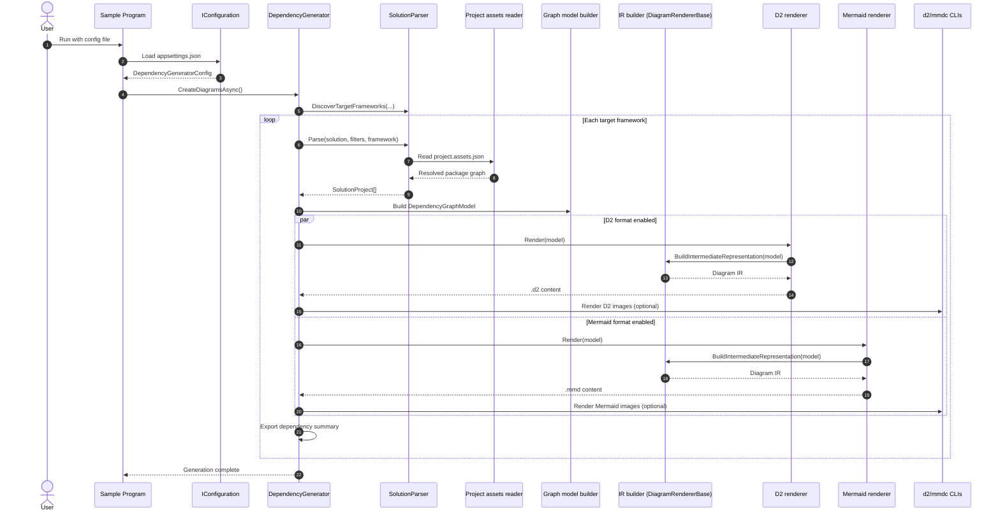

# SlnDependencyDiagramGenerator

Generates D2 and Mermaid diagram files and images for a Visual Studio Solution.


[](https://www.nuget.org/packages/SlnDependencyDiagramGenerator/absoluteLatest/)
[](https://www.nuget.org/packages/SlnDependencyDiagramGenerator/absoluteLatest/)

## Overview

As large applications grow, awareness of dependencies diminishes. Hidden transitive relationships, framework-specific package resolution, and cross-project coupling make it difficult to answer simple questions like "what depends on what?" and "where will a package change have impact?"

`SlnDependencyDiagramGenerator` solves this by parsing a Visual Studio Solution (`.sln` or `.slnx`), filtering projects by include/exclude regex rules, and building dependency graphs for each selected target framework.

Project and framework references are read from the evaluated MSBuild project model (including imports and conditions such as `Directory.Build.props` / `Directory.Build.targets`), while package references are resolved from `obj/project.assets.json` (generated during restore/build). This utility requires those assets files to exist before it runs. Using the assets file means the output reflects NuGet's resolved versions, including Central Package Management and `Directory.Build.props` evaluation.

For each discovered target framework, the generator can process both individual projects and the full solution scope, with configurable transitive package depth and package/framework exclusions.

After gathering all of the information, the generator will produce a 'Dependency Summary' in markdown format,
along with one or more [D2](https://d2lang.org/) (`.d2`) and/or [Mermaid](https://mermaid.js.org/) (`.mmd`) diagram files, as well as either `png`, `svg`, or `pdf` diagrams.

This [example](./Samples/Output/net9.0/d2/slndependencydiagramgenerator.png) has been produced from the solution in this repository.

## Features

- Parses Visual Studio solutions (`.sln` and `.slnx`) and filters projects using include/exclude regex rules.
- Resolves project and framework references from evaluated MSBuild items, including references introduced via `Directory.Build.props` / `Directory.Build.targets`.
- Resolves package graphs from `obj/project.assets.json` (post-restore/build), matching NuGet's resolved package versions.
- Implicitly supports Central Package Management (`Directory.Packages.props`) and `Directory.Build.props` evaluation because dependencies are read from restore/build-generated assets files.
- Auto-discovers target frameworks from restored assets files (no `targetFrameworks` configuration required).
- Separates explicit and transitive package dependencies with configurable transitive depth per scope.
- Supports per-scope generation for individual projects and the full solution graph.
- Supports package-level exclusions via `projects.packagesToExclude`.
- Supports framework-level exclusions via `projects.frameworksToExclude`.
- Generates diagrams in D2 (`.d2`) and/or Mermaid (`.mmd`) formats.
- Exports diagram images as `png`, `svg`, and `pdf`.
- Writes renderer-specific output under each target framework folder (for example `d2` and `mmd`) to avoid name collisions.
- Uses normalized file-safe diagram base names (lowercase slug) for generated diagram and image file names.
- Produces a Markdown dependency summary and highlights multi-version package usage across projects.

## Configuration

The generator offers extensive configuration options that define what projects are parsed, what diagrams are generated,
how those diagrams are styled, and what formats are exported.

At runtime, the `DependencyGeneratorConfig` class provides all configuration options. The sample application included with
the repository generates diagrams for the solution containing this sample application and the `SlnDependencyDiagramGenerator`
package, binding the configuration from its `appsettings.json` file.

```json
{
  "options": {
    "projects": {
      "solutionPath": "..\\..\\..\\..\\SlnDependencyDiagramGenerator.sln",

      "regexToInclude": ["\\\\.*\\.csproj"],

      "regexToExclude": [],

      "packagesToExclude": ["Microsoft.Build", "Microsoft.SourceLink.GitHub"],

      "frameworksToExclude": ["Microsoft.NETCore.App"],

      "individual": {
        "enabled": true,
        "includeDependencies": true,
        "transitiveDepth": 3
      },

      "all": {
        "enabled": true,
        "includeDependencies": true,
        "transitiveDepth": 1
      }
    },

    "diagram": {
      "direction": "LR",

      "frameworkStyle": {
        "fill": "#ECCBC0",
        "opacity": 0.8
      },

      "packageStyle": {
        "fill": "#ADD8E6",
        "opacity": 0.8
      },

      "transitiveStyle": {
        "fill": "#FFEC96",
        "opacity": 0.8
      },

      "groupName": "Dependency Diagram Generator",
      "groupNameAlias": "ddg",

      "grouping": {
        "enabled": true,
        "backgroundStyle": {
          "fill": "#E7EBFC",
          "opacity": 1.0
        }
      },

      "formats": ["d2", "mermaid"]
    },

    "export": {
      "clearContents": true,
      "rootPath": "..\\..\\..\\Output",
      "imageFormats": ["png", "svg", "pdf"]
    }
  }
}
```

An explanation of each section is provided below.

### Projects

Specifies project related options that determine which projects for a given solution are resolved and the depth of their
package dependency graph.

- **SolutionPath**: The relative or fully-qualified path to the solution file to be parsed (`.sln` or `.slnx`).
- **RegexToInclude**: One or more regex patterns to match solution projects to be processed.
- **RegexToExclude**: One or more optional regex patterns to exclude matched projects.
- **PackagesToExclude**: Optional package IDs to exclude from diagrams and summary output (case-insensitive).
- **FrameworksToExclude**: Optional framework reference IDs to exclude from diagrams and summary output (case-insensitive).
- **Individual**: Specifies options specific to the processing of individual projects in a solution.
- **All**: Specifies options specific to the processing of all projects in the solution (collectively).

The `Individual` and `All` nodes provide these options:

- **Enabled**: Indicates if this project scope will be processed.
- **IncludeDependencies**: Indicates if framework and package dependencies should be processed.
- **TransitiveDepth**: Indicates how deep to traverse implicit (transitive) package references. Must be 0 or more.

### Diagram

Specifies diagram options that determine how the diagram will be styled.

- **Direction**: Specifies the direction the diagram flows using flowchart notation (`LR`, `RL`, `TB`, `BT`). The default is `LR`.
- **FrameworkStyle**: The fill style to use for framework dependencies referenced by a project.
- **PackageStyle**: The fill style to use for explicit package dependencies referenced by a project.
- **TransitiveStyle**: The fill style to use for transitive (implicit) package dependencies referenced by a project.
- **GroupName**: The name (title) to use for the group of projects parsed.
- **GroupNameAlias**: The alias to use in the D2 generated file to represent the group of projects parsed.
- **Grouping**: Shared grouping options applied to all diagram formats.
- **Formats**: One or more diagram formats to generate: `d2` and/or `mermaid`.

`FrameworkStyle`, `PackageStyle`, `TransitiveStyle`, and `Grouping.BackgroundStyle` provide these options:

- **Fill**: The CSS or RGB fill color.
- **Opacity**: The opacity. This should be a value between 0 and 1.

`Grouping` provides these options:

- **Enabled**: Indicates whether project and multi-version package grouping containers are rendered.
- **BackgroundStyle**: The fill style to use for group container backgrounds.

### Export

Specifies export path and image format options.

- **ClearContents**: When True, clears the contents of the folder that combines `RootPath` and the target framework
  being processed.
- **RootPath**: The relative or fully-qualified export root path for the generated diagram files and images.
  A sub-folder will be created for each target framework processed, and then per diagram renderer.
- Generated diagram and image file names use normalized file-safe base names (for example, `My Group-All` becomes `my-group-all`).
- **ImageFormats**: The diagram image formats to create. Can be empty, or one or more of "png", "svg", "pdf".

### Tooling Requirements

- D2 output requires the [d2 CLI](https://d2lang.com/tour/install/) to be available on PATH.
- Mermaid image export requires [mmdc (Mermaid CLI)](https://github.com/mermaid-js/mermaid-cli#installation) on PATH when `imageFormats` is not empty.

### Target Framework Discovery

Target frameworks are auto-discovered from each matching project's `obj/project.assets.json` file.
Run `dotnet restore` or build the solution before generating diagrams so these files are present.

Malformed or unreadable solution files (`.sln` or `.slnx`) fail fast with a clear error message; no fallback parsing is attempted.

## Architecture

The engine uses a staged pipeline so dependency discovery, graph shaping, and renderer output stay decoupled.

**Configuration load and bind:**<br/>
The host application loads `appsettings.json`, binds `options` to `DependencyGeneratorConfig`, and constructs `DependencyGenerator`.

**Validation and framework discovery:**<br/>
`DependencyGenerator` validates configuration, initializes MSBuild SDK resolution for in-process project evaluation, discovers target frameworks from each matching project's `project.assets.json`, and verifies required external tools when image export is requested.

**Solution parse and dependency resolution:**<br/>
`SolutionParser` parses solution projects for each target framework, resolves project/framework references from evaluated MSBuild items, and resolves package graphs from assets data (including explicit vs transitive dependencies).

**Graph model construction:**<br/>
`DependencyGenerator` builds a `DependencyGraphModel` for the selected scope (`individual` or `all`), including multi-version package grouping metadata.

**Shared IR build:**<br/>
Each renderer calls `DiagramRendererBase.BuildIntermediateRepresentation(...)` to produce a renderer-neutral intermediate representation (nodes, edges, styles, groups).

**Renderer emission:**<br/>
`D2DiagramRenderer` and `MermaidDiagramRenderer` serialize the same IR into `.d2` and `.mmd` outputs.

**Optional image export:**<br/>
If image formats are configured, the generated diagram text files are rendered via [d2](https://d2lang.com/) and/or [mmdc](https://github.com/mermaid-js/mermaid-cli) into `png`, `svg`, and `pdf`.

### Sequence Diagram



## Samples

The repository includes a full runnable sample setup under `Samples/`, including:

- `DiagramGeneratorSample` (console host used to run the generator)
- `NugetConflictSample` (intentionally conflicting package versions)
- `Output/` (generated example artifacts by target framework)

For detailed documentation of project intent, dependency choices (including intentionally older/conflicting package versions), configuration variants, launch settings, run commands, and troubleshooting, see:

- [Samples/README.md](./Samples/README.md)

## Limitations

- The solution must be restored or built before generation so each project's `obj/project.assets.json` is available.
- Package dependency results reflect the latest available assets state; if `obj/project.assets.json` is stale or missing, run `dotnet restore` (or build) before generation.

## References

The solution parsing behavior implemented in this project is based on the following sources:

- `.sln` parser API used by this project:
  - [Microsoft.Build.Construction.SolutionFile](https://learn.microsoft.com/en-us/dotnet/api/microsoft.build.construction.solutionfile)
- `.sln` file format and load semantics:
  - [Solution (.sln) file](https://learn.microsoft.com/en-us/visualstudio/extensibility/internals/solution-dot-sln-file?view=vs-2022)
- `.sln` and `.slnx` serializer/model library used by this project:
  - [Microsoft.VisualStudio.SolutionPersistence (NuGet)](https://www.nuget.org/packages/Microsoft.VisualStudio.SolutionPersistence/)
  - [microsoft/vs-solutionpersistence (GitHub)](https://github.com/microsoft/vs-solutionpersistence)
  - [Project README (features and API entry points)](https://github.com/microsoft/vs-solutionpersistence/blob/main/README.md)
